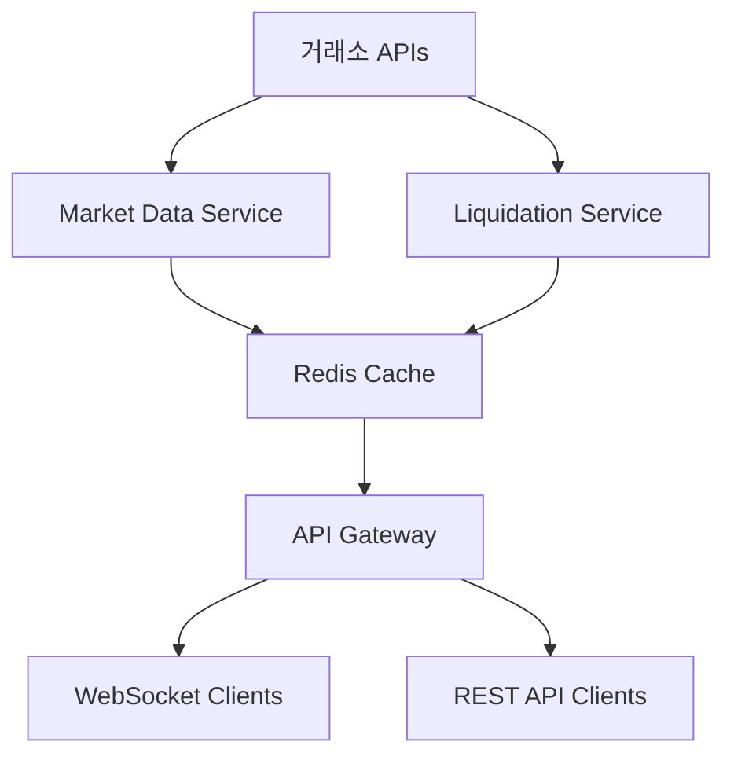

# 📋 서비스 분리 상세 계획

## 🎯 서비스별 데이터 책임

### 📈 Market Data Service (포트 8001)
**서비스명**: `market-data-service`  
**책임 범위**: 거래소 시세 관련 모든 데이터

#### 수집 데이터:
- ✅ **가격 데이터**: `price` (모든 거래소)
- ✅ **거래량 데이터**: `volume` (KRW/USD 거래대금)
- ✅ **변화율 데이터**: `change_percent` (24시간 변화율)
- ✅ **환율 데이터**: `exchange_rate` (USD/KRW), `usdt_krw_rate`
- ✅ **프리미엄 계산**: 김치 프리미엄 계산 로직

#### WebSocket 연결:
- Upbit: `wss://api.upbit.com/websocket/v1`
- Binance: `wss://stream.binance.com:9443/ws/!ticker@arr`
- Bybit: REST API 폴링 (5초 간격)
- Bithumb: REST API 폴링 (3초 간격)

#### 제공 API:
```python
GET /api/market/prices        # 모든 코인 가격 데이터
GET /api/market/volumes       # 거래량 데이터
GET /api/market/premiums      # 김치 프리미엄 데이터
GET /api/market/exchange-rate # 환율 정보
WebSocket /ws/market          # 실시간 시세 스트림
```

---

### ⚡ Liquidation Service (포트 8002) 
**서비스명**: `liquidation-service`  
**책임 범위**: 청산 데이터 전담

#### 수집 데이터:
- ✅ **실시간 청산**: WebSocket 기반 청산 이벤트
- ✅ **청산 통계**: 거래소별 24시간 청산 볼륨
- ✅ **롱/숏 분석**: 포지션별 청산 데이터

#### WebSocket 연결:
- Binance: `wss://fstream.binance.com/ws/!forceOrder@arr`
- Bybit, OKX, BitMEX 등: 시뮬레이션 데이터

#### 제공 API:
```python
GET /api/liquidations/aggregated  # 집계된 청산 데이터  
GET /api/liquidations/debug       # 디버그 정보
GET /api/liquidations/summary     # 청산 요약
WebSocket /ws/liquidations        # 실시간 청산 스트림
```

---

### 🎯 Main API Gateway (포트 8000)
**서비스명**: `api-gateway`  
**책임 범위**: 데이터 집계 및 클라이언트 서비스

#### 주요 기능:
- ✅ **데이터 집계**: Market + Liquidation 서비스 데이터 통합
- ✅ **WebSocket 관리**: 클라이언트 연결 및 브로드캐스팅
- ✅ **API 라우팅**: 프론트엔드 단일 진입점
- ✅ **부가 서비스**: 코인명 매핑, 공포탐욕지수 등

#### 데이터 소스:
```python
# Market Data Service에서 가져오기
market_data = requests.get("http://market-service:8001/api/market/prices")

# Liquidation Service에서 가져오기  
liquidation_data = requests.get("http://liquidation-service:8002/api/liquidations/aggregated")

# 통합 응답 생성
combined_response = {
    "coins": market_data["coins"],
    "liquidations": liquidation_data["liquidations"],
    "timestamp": datetime.now().isoformat()
}
```

#### 제공 API:
```python
GET /api/coins/latest         # 통합된 코인 데이터 (기존과 동일)
GET /api/coin-names          # 코인 한글명
GET /api/fear_greed_index    # 공포탐욕지수
WebSocket /ws/prices         # 통합 실시간 데이터 (기존과 동일)
WebSocket /ws/liquidations   # 청산 데이터 프록시
```

---

## 🔄 데이터 흐름



## 📁 디렉토리 구조

```
backend/
├── market-data-service/     # 새로 생성
│   ├── Dockerfile
│   ├── main.py             # FastAPI 앱
│   ├── market_collector.py # 시세 데이터 수집
│   └── requirements.txt
│   
├── liquidation-service/     # 기존 확장
│   ├── main.py             # 기존 유지
│   └── liquidation_stats_collector.py
│   
├── api-gateway/            # 새로 생성 (기존 app/ 내용 기반)
│   ├── main.py            # 집계 + API 제공
│   ├── models.py          # DB 모델
│   ├── database.py        # DB 연결
│   └── aggregator.py      # 데이터 집계 로직
│   
└── shared/                # 공통 유틸리티
    ├── redis_client.py
    └── websocket_manager.py
```

## 🚀 마이그레이션 단계

### 1단계: Market Data Service 분리
1. `backend/market-data-service/` 디렉토리 생성
2. 기존 `services.py`에서 시세 관련 로직 이동
3. Docker 컨테이너 추가

### 2단계: API Gateway 구성  
1. 기존 `app/main.py`를 `api-gateway/`로 이동
2. 서비스 간 통신 로직 추가
3. 데이터 집계 로직 구현

### 3단계: 테스트 및 최적화
1. 서비스 간 통신 테스트
2. 성능 최적화 (Redis 캐싱)
3. 로그 분리 확인

---

## 💡 핵심 장점

1. **로그 분리**: 각 서비스별 독립적인 로그 관리
2. **장애 격리**: 한 서비스 다운이 전체에 영향 주지 않음  
3. **확장성**: 필요한 서비스만 스케일링 가능
4. **개발 효율**: 팀별 독립적인 개발 가능
5. **디버깅 용이**: 문제 발생 시 해당 서비스만 집중 분석

## ⚠️ 주의사항

1. **서비스 간 통신 지연**: HTTP 통신으로 인한 레이턴시 증가 가능
2. **복잡성 증가**: 배포 및 관리 복잡도 상승
3. **데이터 일관성**: 서비스 간 데이터 동기화 필요
4. **모니터링 필요**: 각 서비스 상태 모니터링 체계 구축